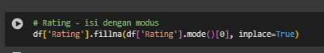

# Laporan Proyek Machine Learning - Muhammad Rozagi
## Project Overview

Sistem rekomendasi telah menjadi bagian penting dalam membantu pengguna menemukan informasi atau konten yang sesuai dengan preferensi mereka, terutama dalam industri hiburan seperti film dan anime. Seiring meningkatnya jumlah judul anime yang dirilis setiap tahun, pengguna semakin membutuhkan bantuan untuk menavigasi dan menemukan anime yang sesuai dengan minat mereka tanpa harus mencari secara manual. Oleh karena itu, sistem rekomendasi menjadi solusi yang sangat dibutuhkan dalam mengatasi permasalahan information overload.

Pendekatan content-based filtering menjadi salah satu metode populer dalam pengembangan sistem rekomendasi karena mampu merekomendasikan item berdasarkan karakteristik konten yang mirip dengan preferensi pengguna sebelumnya. Dalam konteks anime, fitur-fitur seperti genre, sinopsis, studio produksi, dan rating dapat dimanfaatkan untuk mengukur kemiripan antar anime dan memberikan rekomendasi yang lebih personal. Beberapa penelitian, seperti yang dilakukan oleh Jena et al. (2022), menunjukkan bahwa pendekatan content-based filtering dapat memberikan hasil yang cukup akurat dalam rekomendasi anime, terutama ketika data pengguna terbatas. Hal ini juga diperkuat oleh studi Reynaldi dan Istiono (2023) yang berhasil mengintegrasikan content-based filtering dengan teknik web scraping untuk memperkaya data konten dari anime, dan memberikan pengalaman rekomendasi yang lebih relevan.

Lebih lanjut, Putri dan Faisal (2023) membandingkan efektivitas content-based filtering dan collaborative filtering dalam sistem rekomendasi anime dan menemukan bahwa metode content-based filtering memiliki keunggulan dalam kondisi cold-start — yaitu saat data interaksi pengguna masih minim. Oleh karena itu, proyek ini berfokus pada penerapan content-based filtering untuk membangun sistem rekomendasi anime yang mampu menyarankan judul-judul anime berdasarkan kesamaan konten seperti genre dan sinopsis, serta membantu pengguna dalam menemukan anime yang relevan dengan preferensi mereka.

## 📚 Referensi

1. Jena, K. P., Rout, J. K., Nayak, J., & Swain, P. C. (2022). A robust recommendation system for anime using content-based filtering. _Intelligent Systems and Applications_, 13(1), 102–111.
   🔗 [Link Jurnal](https://ssrn.com/abstract=4121831)

2. Reynaldi, M. F., & Istiono, W. (2023). Penerapan metode content-based filtering pada sistem rekomendasi anime berbasis web scraping. _Jurnal Teknologi dan Sistem Informasi_, 4(2), 215–224.
   🔗 [Link Jurnal](https://journalajrcos.com/index.php/AJRCOS/article/view/318)

3. Putri, S. D., & Faisal, A. (2023). Perbandingan metode collaborative filtering dan content-based filtering pada sistem rekomendasi anime. _Jurnal Teknik Informatika_, 9(1), 29–36.
   🔗 [Link Jurnal](https://journal.unimma.ac.id/index.php/komtika/article/view/9219)

## 📌 Business Understanding

### 🧩 Problem Statements
1. Pengguna sering mengalami kesulitan dalam menemukan anime baru yang sesuai dengan preferensi mereka karena banyaknya pilihan yang tersedia.
2. Tidak ada sistem rekomendasi yang secara otomatis menyarankan anime berdasarkan kemiripan konten yang lebih komprehensif, seperti gabungan dari sinopsis, genre, musim tayang, produser, status penayangan, studio produksi, jenis anime, jumlah episode, skor, demografi, dan rating.
3. Informasi deskriptif seperti sinopsis, genre, dan status tayang belum dimanfaatkan secara optimal untuk membantu pengguna dalam pencarian anime yang relevan.

### 🎯 Goals
1. Membangun sistem rekomendasi berbasis content-based filtering yang dapat menyarankan anime baru yang relevan dengan preferensi pengguna, sehingga membantu mengurangi kesulitan dalam mencari tontonan di tengah banyaknya pilihan yang tersedia.
2. Mengembangkan sistem rekomendasi yang mampu memberikan saran anime hanya berdasarkan informasi konten (seperti sinopsis, genre, studio, status, musim tayang, dan lainnya), tanpa memerlukan riwayat aktivitas atau interaksi pengguna, agar tetap efektif digunakan oleh pengguna baru.
3. Memanfaatkan teknik Natural Language Processing (NLP) seperti TF-IDF untuk mengekstraksi fitur teks dari atribut-atribut konten, dan menghitung tingkat kemiripan antar anime menggunakan cosine similarity guna menghasilkan rekomendasi yang akurat dan relevan.

## Data Understanding

Dataset yang digunakan dalam proyek ini terdiri dari data anime yang diambil dari file animes.csv yang berasal dari [Kaggle](https://www.kaggle.com/datasets/harits/anime-database-2022/data). Dataset ini berisi informasi tentang anime-anime dari website MyAnimelist.net yang discrapping lalu diupload kekaggle beserta atribut pendukungnya. Dataset memiliki total 21460 data anime dengan berbagai fitur penting seperti judul, genre, durasi, skor, dan lain-lain.

Variabel-variabel utama yang terdapat dalam dataset Anime.csv adalah sebagai berikut:

- **ID**: ID unik untuk tiap anime.
- **Title**: Judul asli anime.
- **Synonyms**: Judul alternatif atau nama lain.
- **Japanese**: Judul dalam bahasa Jepang.
- **English**: Judul dalam bahasa Inggris.
- **Synopsis**: Ringkasan cerita anime.
- **Type**: Jenis anime (TV, Movie, dll).
- **Episodes**: Jumlah episode.
- **Status**: Status penayangan (Airing, Finished, dll).
- **Start_Aired**: Tanggal mulai tayang.
- **End_Aired**: Tanggal akhir tayang.
- **Premiered**: Musim dan tahun pertama tayang.
- **Broadcast**: Jadwal tayang.
- **Producers**: Pihak produksi anime.
- **Licensors**: Pihak lisensi resmi.
- **Studios**: Studio animasi.
- **Source**: Sumber cerita (Manga, Game, dll).
- **Genres**: Genre utama anime.
- **Themes**: Tema cerita.
- **Demographics**: Segmentasi penonton.
- **Duration_Minutes**: Durasi per episode dalam menit.
- **Rating**: Kategori umur penonton.
- **Score**: Skor rata-rata anime.
- **Scored_Users**: Jumlah pengguna yang memberi skor.
- **Ranked**: Peringkat berdasarkan skor.
- **Popularity**: Urutan berdasarkan popularitas.
- **Members**: Jumlah anggota yang menambahkan ke list.
- **Favorites**: Jumlah pengguna yang memfavoritkan.

Dataset ini terdiri dari 21.460 entri dan 28 kolom dengan berbagai tipe data. Sebagian besar kolom bertipe object, seperti Title, Type, dan Genres, yang menunjukkan data teks atau kategorikal. Beberapa kolom seperti Score, Ranked, dan Favorites bertipe numerik (float64 atau int64). Kolom Duration_Minutes memiliki jumlah data yang lebih sedikit, menandakan adanya nilai yang hilang. Secara keseluruhan, dataset ini cukup besar dan cocok digunakan untuk analisis atau pemodelan terkait anime.

)

Gambar diatas menunjukkan statistik deskriptif dari beberapa kolom numerik dalam dataset anime. Kolom Score memiliki nilai rata-rata sekitar 6.42 dengan nilai maksimum 9.13 dan minimum 1.84, menunjukkan variasi skor penilaian pengguna terhadap anime. Kolom Episodes memiliki nilai maksimum yang sangat tinggi (3057 episode), sementara median-nya hanya 2 episode, yang menandakan distribusi yang sangat miring ke kanan. Kolom Scored_Users dan Members juga menunjukkan perbedaan besar antara nilai minimum dan maksimum, mencerminkan popularitas yang sangat bervariasi antar anime. Selain itu, kolom Duration_Minutes rata-rata berdurasi sekitar 23.9 menit per episode, dengan sebagian besar berada dalam kisaran 22–26 menit.

Gambar tersebut menampilkan grafik batang horizontal yang menunjukkan sepuluh genre anime terpopuler berdasarkan jumlah anime yang termasuk dalam masing-masing genre. Genre Comedy menempati posisi teratas dengan jumlah anime terbanyak, mendekati angka 7000. Genre Action dan Fantasy juga cukup dominan, masing-masing berada di posisi kedua dan ketiga. Genre Unknown muncul di urutan keempat, kemungkinan mencakup entri yang tidak memiliki label genre yang jelas. Sementara itu, genre seperti Romance, Slice of Life, dan Supernatural memiliki jumlah anime yang relatif lebih sedikit dibandingkan genre lain dalam daftar ini.

## Data Preparation
Tahap data preparation dilakukan untuk memastikan bahwa data yang digunakan dalam pelatihan model sudah bersih, valid, dan relevan. Proses ini dimulai dengan pemilihan fitur-fitur yang paling berpengaruh terhadap model sistem rekomendasi CBF, yaitu uid, title, dan genre. Pemilihan ini bertujuan untuk menyederhanakan data dan hanya mempertahankan informasi yang diperlukan dalam proses pemodelan. Setelah itu kolom uid diganti namanya menjadi anime_id untuk memperjelas. Kemudian diterapkan beberapa teknik dalam tahap data preparation yakni:

### 1. Penghapusan kolom yang tidak digunakan

Dalam kode tersebut, kolom-kolom seperti title, synonyms, start_aired, ranked, dan lainnya dihapus dari DataFrame menggunakan df.drop Penghapusan ini dilakukan karena kolom-kolom tersebut tidak digunakan pada permodelan kali ini. Dengan menghapus kolom yang tidak dibutuhkan, dataset menjadi lebih bersih, ringkas, dan efisien untuk dianalisis lebih lanjut atau digunakan dalam pelatihan model machine learning.

### 2. Pengecekan Missing Values

Dari hasil tersebut terlihat bahwa kolom Episodes, Rating, dan Score memiliki nilai kosong, masing-masing sebanyak 547, 545, dan 6898 entri. Nilai kosong ini dapat menyebabkan masalah saat melakukan analisis statistik atau pelatihan model machine learning, karena banyak algoritma tidak bisa menangani data yang hilang. Oleh karena itu, penting untuk menangani nilai-nilai ini, yang akan dilakukan dilangkah selanjutnya

### 3. Penanganan Missing Values

Untuk pada kolom Episodes dan Score yang sebelumnya memiliki nilai kosong diisi menggunakan strategi median melalui SimpleImputer(strategy='median'). Median dipilih karena lebih tahan terhadap outlier dibanding rata-rata, sehingga lebih cocok untuk data yang mungkin memiliki distribusi tidak normal. ColumnTransformer digunakan agar hanya kolom tertentu yang diimputasi, sementara kolom lainnya tetap dipertahankan (remainder='passthrough'). Hasilnya kemudian dikonversi kembali menjadi DataFrame baru, sehingga data siap digunakan untuk analisis lebih lanjut atau pemodelan machine learning tanpa kehilangan informasi penting.

Kemudian pada kolom Rating menggunakan modus (nilai yang paling sering muncul). Dalam hal ini, digunakan fungsi fillna() yang diisi dengan df['Rating'].mode()[0], yaitu nilai modus pertama dari kolom tersebut. Strategi ini sangat sesuai untuk data kategorikal seperti Rating, karena nilai-nilainya biasanya berupa kategori . Dengan mengisi menggunakan modus, kita menjaga konsistensi tipe data dan tidak memperkenalkan bias numerik seperti jika menggunakan mean atau median. 

Setelah menyederhanakan genre, muncul sejumlah missing values pada kolom tersebut. Missing values ini akan ditindak dengan cara dihapus.

### 4. Transformasi ke List 

Pada langkah ini, dilakukan konversi nilai pada beberapa kolom seperti Episodes, Score, dan Rating menjadi tipe data string agar dapat diproses sebagai teks. Selanjutnya, didefinisikan beberapa fungsi seperti c, gen, prod, dan lainnya untuk memisahkan nilai string berdasarkan spasi atau koma menjadi bentuk list. Pemisahan ini bertujuan agar data multikategori yang sebelumnya tergabung dalam satu string (misalnya beberapa genre dalam satu sel) bisa dipecah menjadi elemen-elemen terpisah. Hal ini penting untuk memudahkan proses tokenisasi atau pembuatan fitur berbasis teks, seperti pada metode TF-IDF atau one-hot encoding. Dengan memecah data menjadi format list, representasi data menjadi lebih akurat dan sesuai dengan struktur aslinya.

### 5. Transformasi Kolom Menjadi Format List

Pada langkah ini, dilakukan transformasi terhadap beberapa kolom seperti Synopsis, Type, Status, Premiered, Studios, Genres, dan lainnya dengan menerapkan fungsi apply() untuk mengubah setiap nilai menjadi list dari kata-kata atau elemen yang dipisah berdasarkan spasi atau koma. Transformasi ini bertujuan untuk mempersiapkan data agar kompatibel dengan teknik pemrosesan teks, seperti TF-IDF atau metode tokenisasi lainnya, yang membutuhkan input berupa list kata-kata. Dengan mengubah string panjang menjadi list kata, setiap elemen bisa diproses sebagai fitur individual oleh model. Hal ini juga memungkinkan pengolahan data multikategori atau data teks panjang secara lebih akurat dan efisien.

### 6. Pemangkasan Panjang Fitur Teks

Ditahapan ini, dilakukan pemangkasan elemen pada kolom Synopsis dan Producers menggunakan fungsi apply() dengan lambda. Kolom Synopsis dipangkas menjadi hanya 3 kata pertama, sementara Producers hanya mengambil dua produser pertama. Tujuan dari langkah ini adalah untuk menyederhanakan representasi data dengan mengurangi panjang teks yang mungkin terlalu kompleks atau beragam. Pemangkasan ini membantu mengurangi noise, mempercepat proses komputasi, dan menjaga fokus pada informasi yang paling awal atau paling relevan. 

### 7. Pembersihan Karakter Khusus dan Penggabungan Kata

Pada langkah ini, dilakukan pembersihan data dengan menghapus karakter tanda baca seperti koma (,) dan mengganti spasi ( ) dengan tanpa spasi ('') pada beberapa kolom seperti Synopsis, Type, Status, Premiered, Studios, Genres, Rating, dan Producers. Tujuan utama dari langkah ini adalah untuk menyiapkan data dalam format yang bersih dan seragam, terutama sebelum dilakukan ekstraksi fitur berbasis teks seperti TF-IDF. Penghapusan tanda baca membantu mengurangi noise dalam teks, sedangkan penggabungan kata bertujuan agar istilah yang terdiri dari dua kata atau lebih tetap terbaca sebagai satu entitas

### 8. Penggabungan Informasi Fitur ke dalam Kolom ‘About’

Pada tahap ini, dilakukan penggabungan beberapa kolom informasi seperti Synopsis, Genres, Premiered, Producers, Status, Studios, Type, Episodes, Score, Demographics, dan Rating ke dalam satu kolom baru bernama About. Tujuan dari langkah ini adalah untuk menyatukan semua informasi penting tentang suatu anime ke dalam satu representasi teks utuh yang bisa digunakan sebagai masukan bagi model berbasis teks, seperti TF-IDF atau sistem rekomendasi berbasis konten. Dengan menyatukan berbagai atribut dalam satu kolom, proses ekstraksi fitur menjadi lebih efisien karena seluruh karakteristik yang menggambarkan sebuah anime tersedia dalam satu entitas teks, sehingga memperkuat konteks dan kualitas hasil rekomendasi.

### 9. Penghapusan Kolom Redundan Setelah Penggabungan

Gambar diatas menjelaskan kolom-kolom awal seperti Synopsis, Type, Status, Premiered, Producers, Studios, Genres, Demographics, Rating, Episodes, dan Score dihapus dari DataFrame. Langkah ini dilakukan karena informasi dari kolom-kolom tersebut telah digabungkan ke dalam satu kolom baru yaitu About. Dengan menghapus kolom-kolom asli yang sudah tidak diperlukan, dataset menjadi lebih ringkas dan meminimalkan redundansi, sehingga lebih efisien untuk diproses oleh algoritma selanjutnya seperti vektorisasi teks atau pemodelan sistem rekomendasi.

### 10. Penggantian Nama Kolom untuk Kejelasan

Di langkah ini, nama kolom English diubah menjadi Title. Penggantian ini dilakukan untuk meningkatkan kejelasan dan konsistensi penamaan kolom dalam dataset. Kolom English kemungkinan menyimpan judul anime dalam bahasa Inggris, sehingga menggantinya menjadi Title membuatnya lebih deskriptif dan mudah dipahami, terutama saat digunakan dalam proses analisis, visualisasi, atau pengembangan sistem rekomendasi berbasis konten.

### 11. Penggabungan Daftar Kata menjadi Kalimat Utuh

Pada tahap ini, dilakukan penggabungan elemen-elemen dalam kolom About yang sebelumnya berupa list (daftar kata) menjadi sebuah string tunggal yang dipisahkan oleh spasi. Hal ini dilakukan menggunakan fungsi join(). Langkah ini penting karena algoritma seperti TF-IDF memerlukan input berupa teks dalam format string, bukan list. Dengan menggabungkan daftar kata menjadi satu teks utuh, data siap digunakan untuk ekstraksi fitur berbasis teks, seperti pembuatan vektor representasi untuk sistem rekomendasi.

## Modeling

Tahapan ini merupakan inti dari pembangunan sistem rekomendasi berbasis konten (content-based filtering), yang berfokus pada pencarian kemiripan antar anime berdasarkan informasi deskriptifnya. Dalam tahap ini, berbagai kolom seperti synopsis, genres, type, studios, status, score, dan lainnya digabung menjadi satu kolom teks bernama About. Kolom ini kemudian diproses agar berbentuk string utuh, sehingga siap digunakan sebagai input dalam teknik ekstraksi fitur teks seperti TF-IDF (Term Frequency–Inverse Document Frequency). TF-IDF akan menghitung bobot pentingnya kata-kata dalam teks tersebut, sehingga memungkinkan sistem rekomendasi untuk menemukan anime yang memiliki kemiripan konten berdasarkan informasi yang telah digabungkan tersebu
Langkah-langkah utama dalam proses modeling adalah sebagai berikut:

### 1. Inisialisasi dan Transformasi TF-IDF
TfidfVectorizer digunakan untuk mengubah data teks pada kolom About menjadi representasi vektor numerik berdasarkan pentingnya kata. Parameter max_features=5000 membatasi jumlah fitur, dan stop_words='english' menghapus kata umum yang tidak memiliki makna penting. Vektor ini akan digunakan untuk mengukur kemiripan antar anime.

### 2. Perhitungan Cosine Similarity
cosine_similarity digunakan untuk menghitung tingkat kemiripan antar anime berdasarkan vektor TF-IDF dari kolom About. Hasilnya adalah matriks kemiripan yang menunjukkan seberapa mirip satu anime dengan anime lainnya berdasarkan kontennya.

### Output Top-N 

Berikut merupakan output Top-10 hasil rekomendasi untuk anime 'Naruto' :

## Evaluation
Untuk mengevaluasi performa sistem rekomendasi berbasis konten ini, digunakan metrik Precision. Precision adalah salah satu metrik evaluasi yang umum digunakan dalam sistem informasi untuk mengukur ketepatan dari hasil rekomendasi. Metrik ini menunjukkan seberapa banyak rekomendasi yang diberikan benar-benar relevan dengan item input. Berikut merupakan rumus precision:

Pada anime 'Naruto sebagai input, sistem menghasilkan 10 rekomendasi teratas berdasarkan kemiripan atribut yang sudah disebutkan di problem statement. Dari 10 rekomendasi tersebut, sebanyak 10 memiliki atribut yang sama dengan Naruto. Maka nilai precision-nya adalah:

  

Selain itu juga dilakukan visualisasi menggunakan histogram untuk skor ksamaan antar anime dengan input Naruto

Visualisasi histogram distribusi cosine similarity yang ditampilkan menunjukkan bahwa sebagian besar anime dalam dataset memiliki tingkat kemiripan yang rendah terhadap anime yang dijadikan input, dalam hal ini Naruto. Sebaliknya, hanya sebagian kecil anime yang memiliki skor kemiripan tinggi. Hal ini menunjukkan bahwa model content-based filtering yang dibangun mampu membedakan dengan akurat mana anime yang benar-benar serupa dan mana yang tidak, berdasarkan informasi konten seperti sinopsis, genre, musim tayang, studio produksi, dan elemen deskriptif lainnya yang telah diekstraksi menggunakan teknik TF-IDF.

Distribusi cosine similarity ini menjadi bukti bahwa model telah bekerja sesuai dengan prinsip dasar content-based filtering, yaitu merekomendasikan item yang memiliki kemiripan tinggi secara konten. Ini sangat selaras dengan kebutuhan pengguna yang ingin menemukan anime baru yang sejalan dengan preferensi mereka, tanpa harus mencari secara manual atau mengandalkan data interaksi

### Keterkaitan Evaluasi Model dengan Business Understanding

#### Problem Statement
Model sistem rekomendasi berbasis content-based filtering yang dibangun telah berhasil menjawab seluruh pernyataan masalah yang telah dirumuskan:
- Masalah kesulitan dalam menemukan tontonan yang relevan dari jumlah pilihan yang sangat banyak berhasil dijawab melalui sistem yang menyaring secara cerdas berdasarkan kemiripan konten.
- Model mampu memberikan rekomendasi anime yang mirip berdasarkan gabungan atribut konten yang luas, tidak hanya terbatas pada genre saja, namun juga termasuk sinopsis, status, studio, jumlah episode, dan lainnya, yang sebelumnya kurang dimanfaatkan secara optimal.
- informasi deskriptif sudah digunakan dalam model dan bekerja dengan baik untuk membantu pengguna dalam pencarian anime yang relevan

#### Goals
Dengan demikian, seluruh tujuan dari tahap Business Understanding dapat dikatakan tercapai:
- Sistem rekomendasi berbasis content-based filtering berhasil dibangun dan berfungsi secara efektif.
- Rekomendasi yang dihasilkan sudah memperhitungkan atribut konten secara menyeluruh, menjawab kebutuhan pengguna untuk menemukan anime yang sesuai tanpa harus bergantung pada data aktivitas sebelumnya.
- Teknik NLP seperti TF-IDF serta cosine similarity mampu mengekstraksi dan membandingkan konten dengan baik, menghasilkan pengalaman eksplorasi anime yang lebih personal, otomatis, dan efisien bagi pengguna.
